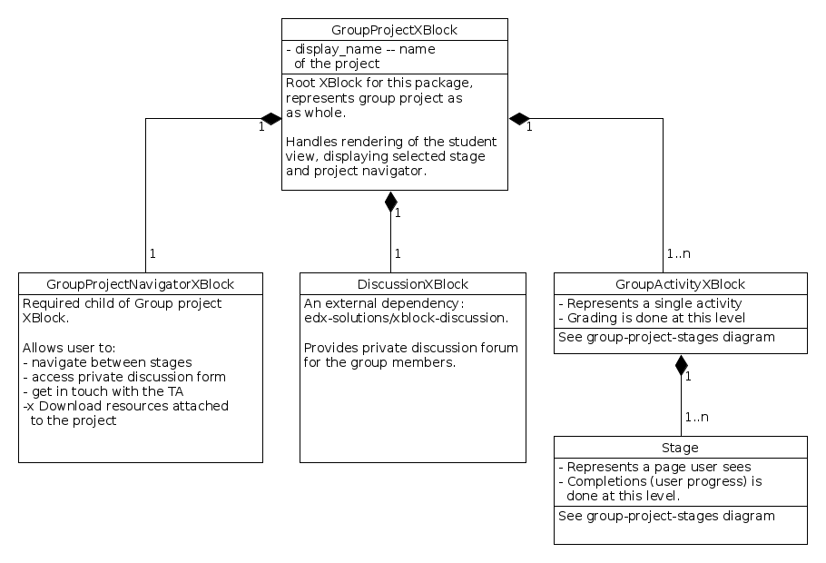
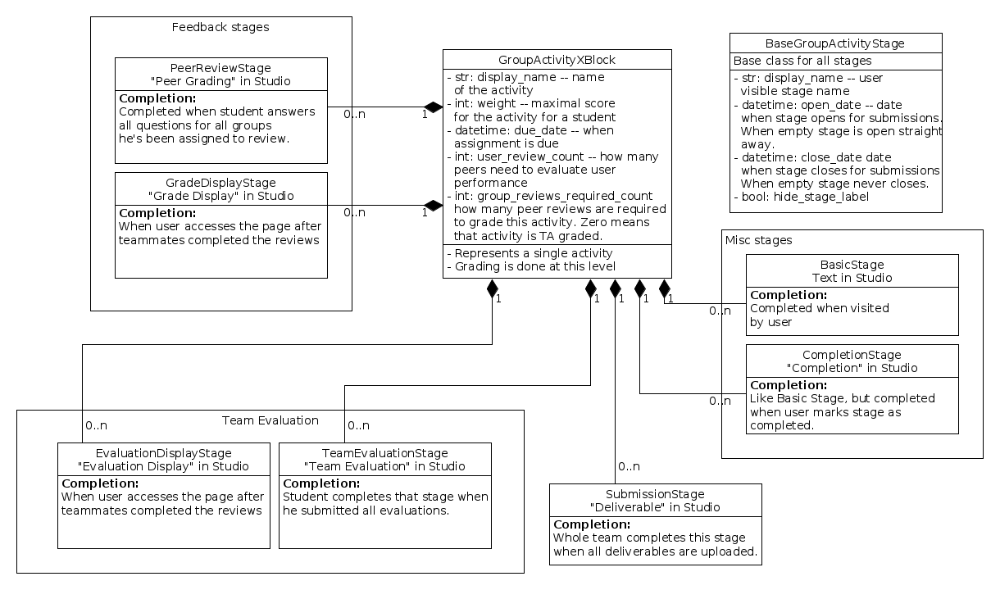
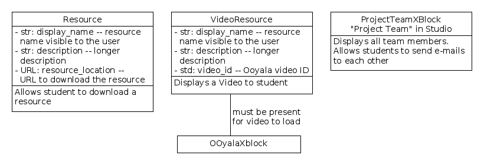
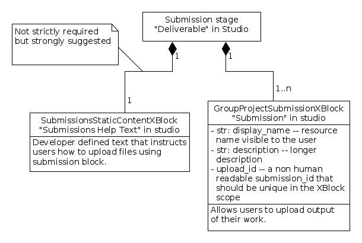
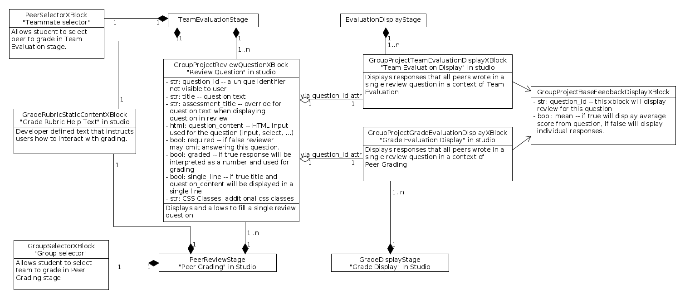

# Group Project building blocks

The following blocks are a part of Group Project XBlock v2.

## Top-level XBlocks

* ` Group Project` - top level XBlock, represents group project as a whole.
    * Settings:
        * `Display Name` - human-friendly name for Group Project - displayed in admin console.
    * Components: 
        * `Group Project Activity` - multiple instances.
        * [`Group Project Navigator`](#project-navigator-and-views) - single instance
        * `Discussion` - external XBlock: see https://github.com/edx-solutions/xblock-discussion; single instance
* `Group Project Activity` - represents single activity in group project, grading happens at this level, hence the block
    carries settings for grading
    * Settings:
        * `Display Name` - human-friendly activity name - appears in admin console and in Project Navigator (i.e. 
            visible both to students and course staff)
        * `Weight` - grading attribute - the higher the weight the more influential this activity will be compared to 
            other graded exercises in the same grading bucket (including group project activities and graded exercises)
        * `Reviews Required Minimum` - Peer Grading attribute - sets a number of reviews to be received by a workgroup
            so it can be graded. If set to 0 (zero), activity is considered TA-graded.
        * `User Reviews Required Minimum` - Peer Grading attribute - the minimum number of reviews for other groups 
            an individual student should perform.
        * `Due Date` - Activity due date - displayed to students in Apros progress page. Does not actually prevent users
            from uploading submissions, casting reviews and other group project related activities as it is superseded 
            by individual stages due dates. Informational only.
    * Components:
        * [Stage XBlocks](#stages-xblocks) - multiple instances
        
        
        
## Project Navigator and Views

Project Navigator XBlock is designed to allow quick access to Navigation and other commonly used group project features.

* `Group Project Navigator` - top level Project Navigator XBlock. Can contain multiple Project Navigator View XBlocks 
    (one per type at most), and allows switching between the views.
    * Settings - none
    * Components (single instance per type):
        * `Navigation View` - provides group project navigation capabilities. **Required.**
        * `Submission View` - lists all the required submissions, provides options to upload a submission, 
            review and re-upload previous submissions.
        * `Resources View` - lists all the resources configured for group project.
        * `Ask a TA View` - provides simple interface to message course TA.
        * `Private Discussion View` - opens private discussion XBlock. Requires `Discussion` to be added to root `Group
            project` XBlock.
            
**Important note:** Neither `Group Project Navigator` nor navigation view XBlocks have any configurable settings.
        
## Stage XBlocks

Stage XBlocks provide core functionality to the group project. There are multiple types of stages, each encapsulating 
one of the possible steps towards project completion. Unlike other XBlocks, stages have some common settings and can
use some common components:

* Common settings:
    * `Display Name` - human-friendly stage name - appears in admin console and in Project Navigator (i.e. 
        visible both to students and course staff). Default: some sensible name for a stage (different per stage type)
    * `Open Date` - sets stage open date - the date when stage becomes available to the students, so that students can
        start perform actions on that stage (upload submission, cast a review, etc.). Default: no open date - stage is
        available right away. 
    * `Close Date` - sets stage close date - the date when stage becomes closed, so students can no longer perform 
        actions on that stage. Default: no close date - stage is always available. 
    * `Hide stage type label` - governs stage appearance in Project Navigator view. If set to True, stage Display Name
        will be prefixed with stage type (i.e. `Overview`, `Task`, `Review`, etc.) in project navigation. 
        Otherwise, Display Name is displayed as is. Default: True

               
        
* Common components:
    * `HTML` - HTML XBlock provided by edX platform - contains arbitrary HTML markup (text, images, etc.)
    * `Resource` - group project resource XBlock - see [Stage components](#stage-components) section for details
    * `VideoResource` - group project resource XBlock - see [Stage components](#stage-components) section for details
    * `Project Team` - project team XBlock - see [Stage components](#stage-components) section for details
    

        
Available stage types:

* `Text` - simple stage displaying a course author-defined text, images, etc.
    * Settings - no stage-specific settings
    * Components - no stage-specific components
    * Completion criteria: completed when user first visits it when the stage is open.
* `Completion` - similar to `Text` stage, but requires user interaction to be marked as completed - checking a 
    checkbox. Note that checkbox becomes disabled when checked, so it's not possible for a student to cancel 
    "stage completed" action.
    * Settings - no stage-specific settings
    * Components - no stage-specific components
    * Completion criteria: completed when user checks a checkbox "Yes, I have completed this task"
* `Deliverable` - stage that specifies the list of group submissions.
    * Settings - no stage-specific settings
    * Components:
        * `Submissions Help Text` - static (developer-defined) help text instructing students to open Project Navigator
            Submissions view to upload submissions. Help text contains a link that opens the view automatically.
        * `Submission` - specifies one deliverable (aka submission) - see [Stage components](#stage-components) section 
            for details.
    * Completion criteria: completed when all the submissions are uploaded. Note that submissions are required on group
        basis rather than on individual basis, so all the students in the group get this stage completed as soon as
        any of them uploads last submission. It does not matter which student uploads the submission - all uploads
        count towards the entire group's progress.
        
    
* `Team Evaluation` - allows students to provide anonymous feedback to their teammates.
    * Settings - no stage-specific settings
    * Components:
        * `Teammate selector` - displays a list of teammates. **Required, one at most**
        * `Grade Rubric Help Text` - static (developer-defined) help text instructing students to open Project Navigator
            Resources view to access group project documents on grading. Help text contains a link that opens the view 
            automatically.
        * `Review Question` - represents review question - see [Stage components](#stage-components) section for details
    * Completion criteria: completed when student provided answers to all required questions for all teammates.
* `Peer Grading` - allows students and/or TAs to provide anonymous feedback and grades to other groups.
    * Settings - no stage-specific settings
    * Components:
        * `Group selector` - displays a list of groups student should grade. **Required, one at most**
        * `Grade Rubric Help Text` - static (developer-defined) help text instructing students to open Project Navigator
            Resources view to access group project documents on grading. Help text contains a link that opens the view 
            automatically.
        * `Review Question` - represents review question - see [Stage components](#stage-components) section for details
    * Completion criteria: completed when student provided answers to all required questions for all groups assigned 
        for review.
* `Evaluation Display` - displays feedback from other teammates for students
    * Settings - no stage-specific settings
    * Components:
        * `Team Evaluation Display` - block that displays teammates' answers to one of the review questions. 
            See [Stage components](#stage-components) section for details.
    * Completion criteria: completed when user first visits it when the stage is open and teammates have completed their
        reviews, i.e., when teammates have provided answers to all the required questions chosen in 
        `Team Evaluation Display` blocks.
* `Grade Display` - displays group feedback and grades from students and/or TAs 
    * Settings - no stage-specific settings
    * Components:
        * `Grade Evaluation Display` - block that displays other students' and/or TAs answers to one of the review 
            questions. See [Stage components](#stage-components) section for details.
    * Completion criteria: completed when user first visits it when the stage is open and grades are available, i.e. 
        when other students and/or TAs provided answers to all the required questions chosen in 
        `Grade Evaluation Display` blocks.
            
                        
            
## Stage components

The following XBlocks are building blocks of stages. They correspond to a single stage only, and are generally useless 
outside stage context.

* `Resource` - resource XBlocks provides means to attach documents to Group Project. Those can be some general 
    document related to group project context, grading criteria rubric, deliverable template, or any other kind of
    document.
    * Settings:
        * `Display Name` - human-friendly resource name - displayed in Project Navigator Resources View
        * `Resource Description` - a longer human-friendly description of the resource - displayed in Project Navigator 
            Resources View
        * `Resource Location` - url to view/download the resource.
* `Video Resource` - same as `Resource` XBlock, but represents a video resource. Instead of downloading it opens a video
    viewer. Requires third-party `Ooyala Player` to be installed.
    * Settings:
        * `Display Name` - human-friendly resource name - displayed in Project Navigator Resources View
        * `Resource Description` - a longer human-friendly description of the resource - displayed in Project Navigator 
            Resources View
        * `video_id` - Ooyala Video ID to show to students
* `Submissions Help Text` - static (developer-defined) help text instructing students to open Project Navigator 
    Submissions view to upload submissions. Help text contains a link that opens the view automatically.
    * Settings - none
    
    
    
* `Grade Rubric Help Text` - static (developer-defined) help text instructing students to open Project Navigator
    Resources view to access group project documents on grading. Help text contains a link that opens the view 
    automatically.
    * No author-customizable settings
* `Submission` - component that encapsulates single group project submission.
    * `Display Name` - human-friendly submission name - displayed in Project Navigator Submisssions View
    * `Submission Description` - a longer human-friendly description of a submission - displayed in Project 
        Navigator Submisssions View
    * `Upload ID` - upload identifier - used to identify submission to uploads API. Submissions with same upload ID
        will be updated simultaneously, so it is best to assign some unique value here. Not displayed anywhere, so
        does not need to be human-comprehensible (i.e. random strings are good idea)
* `Teammate Selector` - displays a list of teammates and allows switching between them. Only usable in conjunction with
    `Team Evaluation` stage and `Review Question` blocks. When teammate is selected, `Team Evaluation` stage downloads 
    current student's responses to `Review Question` and sets corresponding `Review Question` values. Displays current
    student progress of reviewing other teammates by displaying completion icons next to each teammate.
    * No author-customizable settings
    
    
    
* `Group Selector` - displays a list of groups and allows switching between them. Only usable in conjunction with
    `Peer Grading` stage and `Review Question` blocks. When group is selected, `Peer Grading` stage downloads 
    current student's responses to `Review Question` and sets corresponding `Review Question` values. Displays current
    student progress of reviewing other teams by displaying completion icons next to each team. Allows reviewing
    group submissions by clicking "View team submissions"
    * No author-customizable settings
    
    
    
* `Review Question` - represents single review question.
    * `Question ID` - question identifier. Defaults to automatically generated random string
    * `Question Text` - question text
    * `Assessment Question Text` - this setting can be used to override `Question Text` when answers are displayed to 
        the team or teammate being reviewed. E.g. `Question Text`: "Was it easy to communicate wit this teammate?" 
        can be overridden with `Assessment Question Text`: "Was it easy to communicate with you?".
    * `Question Content` - HTML input control (`input`, `select` or `textarea`) for entering response to the question.
    * `Required` - boolean flag. If True, the question is required - it is enforced to be not empty in UI and is 
        used to determine if the stage is completed by the student.
    * `Grading` - boolean flag. If True, this question is a grading question - it should provide answer as a decimal
        number and it is used for grading.
    * `Single Line` - boolean flag. If set to True, question label and content are placed on the same horizontal 
        line, allowing for more compact layout.
    * `CSS Classes` - author-defined additional CSS classes.

    
    
* `Team Evaluation Display`, `Grade Evaluation Display` - blocks to display review question responses in "display" 
    stages (`Evaluation Display` and `Grade Display`, respectively)
    * Settings:
        * `Question ID` - question identifier - responses to this question will be shown.
        * `Show Mean Value` - boolean flag, alters question response representation. If True the response will be 
            considered numerical, and a mean value of all responses will be displayed.
            
    
            
* `Project Team` - this block displays current project team - all student team members including current student - and 
    allows sending emails to individual teammates and to the team as a whole.
    * No author-customizable settings
    
    
    